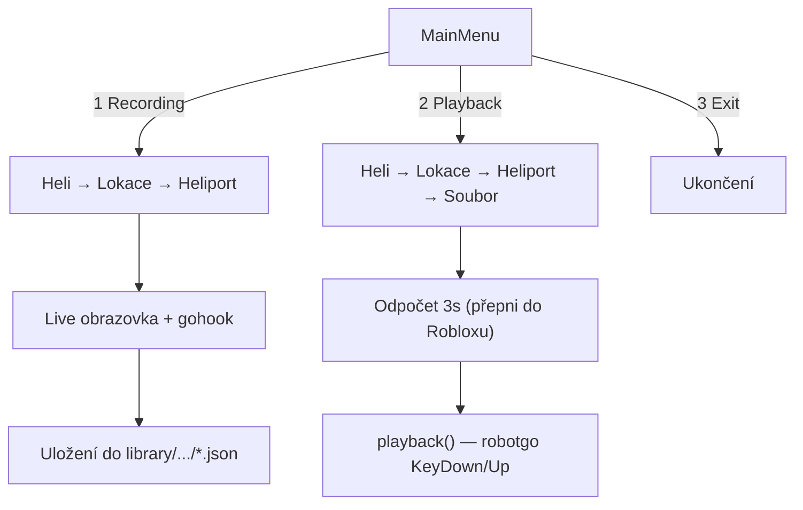
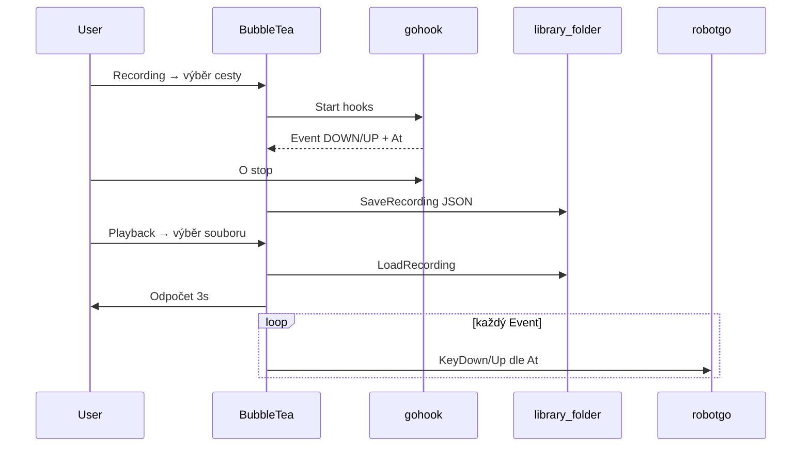

# BRM5 Recorder — playback, knihovna a Bubble Tea menu

## Současný stav

Projekt má základní nahrávání v `[recording.go](c:\Users\START\Downloads\go youtube\recording.go)` (zatím jen klávesa `W`, stop klávesou `O`, uložení do `data.json`). `[playback.go](c:\Users\START\Downloads\go youtube\playback.go)` obsahuje jen duplicitní struct `Events`. `[event.go](c:\Users\START\Downloads\go youtube\event.go)` je prázdný. `[main.go](c:\Users\START\Downloads\go youtube\main.go)` má nepoužité importy Bubble Tea a neúplné bufio menu.



## Architektura (zachována, jen doplněna)

| Soubor                                                             | Odpovědnost                                           |
| ------------------------------------------------------------------ | ----------------------------------------------------- |
| `[event.go](c:\Users\START\Downloads\go youtube\event.go)`         | `Event`, `Recorder`, `LoadRecording`, `SaveRecording` |
| `[recording.go](c:\Users\START\Downloads\go youtube\recording.go)` | gohook registrace, `recording()`                      |
| `[playback.go](c:\Users\START\Downloads\go youtube\playback.go)`   | `playback()`, simulace kláves                         |
| `[library.go](c:\Users\START\Downloads\go youtube\library.go)`     | **nový** — načtení `library.json`, cesty ke složkám   |
| `[library.json](c:\Users\START\Downloads\go youtube\library.json)` | **nový** — šablona stromu (doplníš později)           |
| `[ui.go](c:\Users\START\Downloads\go youtube\ui.go)`               | **nový** — Bubble Tea modely a navigace               |
| `[main.go](c:\Users\START\Downloads\go youtube\main.go)`           | spuštění `tea.NewProgram` místo bufio                 |

Nejde o přepis — existující logika v `recording.go` zůstane, jen se přesune ukládání/načítání do `event.go` a přidají se nové soubory.

---

## Krok 1 — Sjednocení datové vrstvy (`event.go`)

**Proč:** V `recording.go` i `playback.go` je stejná struktura pod různými jmény (`Event` vs `Events`). JSON v `[data.json](c:\Users\START\Downloads\go youtube\data.json)` používá obal `{"events":[...]}`.

**Co uděláme:**

- Přesunout `Event` a `Recorder` do `event.go`
- Přidat:

```go
func LoadRecording(path string) (Recorder, error) {
    data, err := os.ReadFile(path)
    // json.Unmarshal do Recorder
}

func SaveRecording(path string, recorder Recorder) error {
    // json.Marshal + os.WriteFile (místo hardcoded "data.json")
}
```

- V `recording.go` volat `SaveRecording(fullPath, recorder)` místo lokální funkce
- Smazat duplicitní struct z `playback.go`

**Vysvětlení:** Jedna struktura = jeden formát JSON pro nahrávání i přehrávání. Cesta k souboru se určí až z knihovny, ne natvrdo `data.json`.

---

## Krok 2 — `playback()` s časovou osou (`playback.go`)

**Proč:** `gohook` umí jen **poslouchat** klávesy, ne je posílat. Pro DOWN/UP replay použijeme `[github.com/robotn/robotgo](https://github.com/go-vgo/robotgo)` (`KeyToggle` / `KeyDown` / `KeyUp`) — stejný ekosystém jako gohook.

**Algoritmus playbacku:**

```go
func playback(rec Recorder) error {
    if len(rec.Events) == 0 { return fmt.Errorf("prázdný záznam") }

    start := time.Now()
    for _, ev := range rec.Events {
        target := time.Duration(ev.At) * time.Millisecond
        if wait := target - time.Since(start); wait > 0 {
            time.Sleep(wait)
        }
        if err := applyKey(ev); err != nil { return err }
    }
    return nil
}
```

**Mapování kláves** (`applyKey`):

- `Type: "DOWN"` → `robotgo.KeyToggle(keyLower, "down")`
- `Type: "UP"` → `robotgo.KeyToggle(keyLower, "up")`
- Mapa pro speciální klávesy: `Shift` → `shift`, `Space` → `space`, `Ctrl` → `ctrl`

**Vysvětlení každého kroku:**

1. **Načtení** — `LoadRecording(path)` převede JSON na `[]Event` seřazené podle `At` (ms od startu nahrávky)
2. **Start hodin** — `start := time.Now()` je nový „nulový bod" přehrávání
3. **Čekání** — před každým eventem počkáme rozdíl mezi cílovým `At` a uběhlým časem (zachová timing mezi stisky)
4. **Simulace** — robotgo pošle DOWN/UP do aktivního okna (Roblox musí být focus — proto odpočet v UI)

**Bezpečnost:** Na konci playbacku volat `releaseAllKeys()` — pro každou drženou klávesu poslat UP, aby nezůstala „seknuta".

---

## Krok 3 — Knihovna nahrávek (`library.json` + `library.go`)

**Struktura na disku:**

```
library/
  blackhawk/
    anizik/
      heliport_alpha/
        flight_001.json
  blackbird/
  tf82/
  chinook/
  paluby/
  kaluby/
```

**Šablona `library.json`** (2–3 ukázkové lokace/heliporty, zbytek doplníš):

```json
{
  "helicopters": [
    {
      "id": "blackhawk",
      "name": "Black Hawk",
      "locations": [
        {
          "id": "anizik",
          "name": "Anizik",
          "heliports": [
            { "id": "alpha", "name": "Heliport Alpha" },
            { "id": "bravo", "name": "Heliport Bravo" }
          ]
        }
      ]
    }
  ]
}
```

**Funkce v `library.go`:**

- `LoadLibrary()` — načte JSON
- `RecordingDir(heli, loc, heliport) string` — cesta `library/{heli}/{loc}/{heliport}/`
- `ListRecordings(dir) ([]string, error)` — `.json` soubory v heliportu
- `EnsureDir(path)` — vytvoří složku při ukládání

**Vysvětlení:** Strom helikoptér/lokací/heliportů je v configu (snadno editovatelný). Samotné nahrávky jsou soubory ve složkách — playback jen vybere soubor a zavolá `LoadRecording`.

---

## Krok 4 — Rozšíření nahrávání (`recording.go`)

**Změny (minimální diff):**

- Registrovat všechny letové klávesy: `w`, `a`, `s`, `d`, `shift`, `space` (DOWN i UP)
- Obecná helper funkce `registerKey(key string)` místo kopírování callbacků
- Eventy posílat do Bubble Tea přes channel (`chan Event`) pro live obrazovku
- Stop stále klávesou `O`
- Uložit na cestu z knihovny (ne `data.json` v rootu)

**Live obrazovka:** Bubble Tea model zobrazí:

- vybranou helikoptéru / lokaci / heliport
- běžící čas nahrávky
- posledních ~10 eventů (scroll)
- nápovědu: „Stiskni O pro ukončení"

---

## Krok 5 — Bubble Tea menu (`ui.go` + `main.go`)

**Hlavní model** s režimy (enum `screen`):

| Obrazovka             | Akce                              |
| --------------------- | --------------------------------- |
| `screenMain`          | 1 Recording, 2 Playback, 3 Exit   |
| `screenHeli`          | seznam z `library.json`           |
| `screenLocation`      | lokace vybrané helikoptéry        |
| `screenHeliport`      | heliporty lokace                  |
| `screenRecordingPick` | jen pro Playback — seznam `.json` |
| `screenRecordingLive` | live nahrávání                    |
| `screenCountdown`     | 3…2…1 před playbackem             |

**Navigace:** šipky ↑↓, Enter = výběr, Esc = zpět, `q` = zpět z podmenu.

**Lip Gloss styly** (rozšíříme existující `titleStyle` v `main.go`):

- titulek, vybraná položka, breadcrumb (`Black Hawk > Anizik > Alpha`)

**Spuštění playbacku:**

1. Uživatel vybere recording
2. Obrazovka odpočtu: „Přepni do Robloxu… 3, 2, 1"
3. `tea.Cmd` spustí `playback()` v goroutine
4. Po dokončení návrat do hlavního menu + status „Playback hotov"

**Změna v `main.go`:**

```go
func main() {
    p := tea.NewProgram(newModel(), tea.WithAltScreen())
    if _, err := p.Run(); err != nil { ... }
}
```

Odstraníme bufio menu — celé ovládání přes TUI.

---

## Krok 6 — Závislosti

Do `[go.mod](c:\Users\START\Downloads\go youtube\go.mod)` přidat:

```
github.com/robotn/robotgo
```

Bubble Tea a Lip Gloss už jsou v projektu (zatím `indirect` — po `go mod tidy` budou direct).

**Poznámka pro Windows:** robotgo a gohook vyžadují CGO. Build: `go build` s nainstalovaným GCC (MinGW-w64). Pokud build selže, ověříme toolchain.

---

## Tok dat (shrnutí)



---

## Co záměrně neměníme

- Balíček `main` (žádný nový modul/subfolder pro Go kód)
- Formát JSON eventů (`key`, `type`, `at`) — kompatibilní s existujícím `data.json`
- gohook pro nahrávání (ne robotgo)
- ASCII logo a Lip Gloss titulek

## Testovací plán

1. `go build` — ověření kompilace s robotgo/CGO
2. Spustit TUI → Recording → vybrat cestu → stisknout W několikrát → O → soubor v `library/.../`
3. Playback → stejná cesta → vybrat soubor → odpočet → ověřit timing v Notepadu (jednodušší než Roblox)
4. Esc/q navigace zpět ve všech úrovních menu

Poznámka muzes prepsat soucasnou logiku jen mi ji zakomentuj tu puvodni
